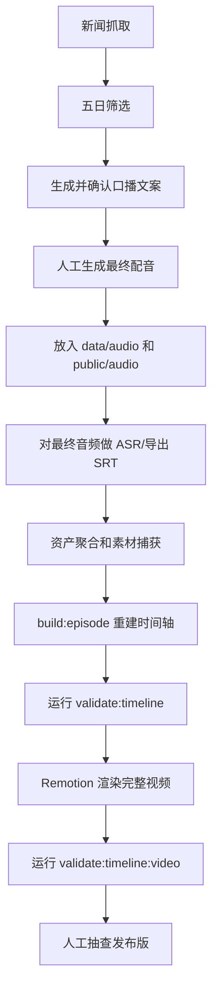

# 音频、字幕、画面同步流程

这个流程用于「一周科技大事」栏目从口播文案到最终视频的同步控制。核心原则是：最终配音音频是唯一时间基准。

## 为什么之前会不同步

测试阶段的问题不是 Remotion 本身，而是时间基准错了：

- 口播文字是一个预估时间。
- 手工字幕是一个预估时间。
- 画面分段也是一个预估时间。
- 但最终配音的真实时长和语速不同。

只要最终音频不是按同一时间轴生成，后半段必然出现字幕、画面和声音漂移。

## 正确生产顺序

口播文案应在五日筛选之后生成并提交给用户确认。素材聚合和素材捕获放在最终口播、MP3 和 SRT 之后执行，这样画面节奏才能跟真实配音一致。

### 1. 新闻抓取与五日筛选

```bash
npm run news:daily -- --date YYYY-MM-DD
npm run news:select -- --date YYYY-MM-DD
```

五日筛选决定本期讲哪几条新闻。

### 2. 生成并确认口播文案

Codex 输出两份内容：

- `口播全文`：给你复制到配音网站。
- `分段锚点表`：标记每条新闻从哪句话开始。

示例：

| 段落 | 锚点句 | 画面主题 |
| --- | --- | --- |
| intro | 这几天科技圈最值得看的 | 本期主线 |
| news_1 | 第一件事，OpenAI 推出 Deployment Company | OpenAI 企业部署 |
| news_2 | 第二件事，台积电上调芯片市场展望 | AI 算力账单 |
| outro | 总结一下 | 总结页 |

### 3. 你生成最终配音

你把最终配音放入：

```text
data/audio/YYYY-MM-DD-voiceover.mp3
```

然后同步复制到：

```text
public/audio/YYYY-MM-DD-voiceover.mp3
```

后续所有时间都以这个音频为准。

### 4. 对最终配音做转写或强制对齐

最佳方案是：对最终音频重新 ASR 转写，得到真实字幕时间。

可选方案：

- 优先：用 Whisper / WhisperX / 剪映识别字幕导出 SRT。
- 次选：用配音网站自带字幕时间。
- 临时方案：按最终音频时长等比压缩旧字幕，只适合粗校准，不适合作为最终生产标准。

最终字幕保存为：

```text
data/subtitles/YYYY-MM-DD-aligned.srt
```

### 5. 资产聚合和素材捕获

```bash
npm run news:aggregate:assets -- --date YYYY-MM-DD
npm run capture:daily-assets -- YYYY-MM-DD
```

素材捕获要读取已确认口播稿；最终 SRT 已存在时，后续 `build:episode` 会按真实字幕时间重新分配 visual beats。

### 6. 从字幕锚点生成画面时间轴

画面段落不能手写固定秒数，而要从字幕中找锚点句：

- `第一件事` 出现时，切到第一条新闻素材。
- `第二件事` 出现时，切到第二条新闻素材。
- `总结一下` 出现时，切到总结页。

这样画面切换会天然跟配音同步。

### 7. 生成视频数据

`src/data/currentEpisode.ts` 中必须满足：

- `durationSeconds` 等于最终配音真实时长。
- `durationInFrames = Math.ceil(durationSeconds * fps)`。
- `captions` 来自最终音频识别后的字幕。
- `segments` 和 `visualBeats` 来自字幕锚点，而不是人工估算。

### 8. 渲染前校验

渲染前必须运行：

```bash
npm run validate:timeline
```

只有通过后再渲染。

### 9. 渲染后校验

渲染完整视频后运行：

```bash
npm run validate:timeline:video
```

确认：

- 配音时长约等于视频时长。
- 字幕最后时间约等于视频时长。
- 画面最后段落约等于视频时长。
- 视频中音频编码正常。

## 最佳实践

### 不要做

- 不要在配音前锁死视频时长。
- 不要用文字字数估算字幕时间做最终版。
- 不要用旧 SRT 直接套新配音。
- 不要只看开头是否同步，后半段更容易漂移。

### 应该做

- 配音完成后再生成最终字幕。
- 字幕完成后再生成画面时间轴。
- 画面段落用锚点句绑定，而不是写死秒数。
- 每次出片前后都跑时间轴校验。
- 人工检查至少三个位置：开头 10 秒、中间一处段落切换、结尾 20 秒。

## 推荐最终流程



## 对当前项目的改进方向

为了接近“完美同步”，后续应把以下两个动作脚本化：

1. `sync:from-audio`
   - 输入最终配音和口播文本。
   - 输出 aligned SRT。
   - 输出 segment 时间轴。

2. `build:episode`
   - 读取某一期配置。
   - 自动复制音频、读取字幕、更新 `src/data/currentEpisode.ts`。
   - 校验通过后才允许渲染。

这样你只需要负责确认文案和下载最终配音，其余同步步骤由项目自动完成。
